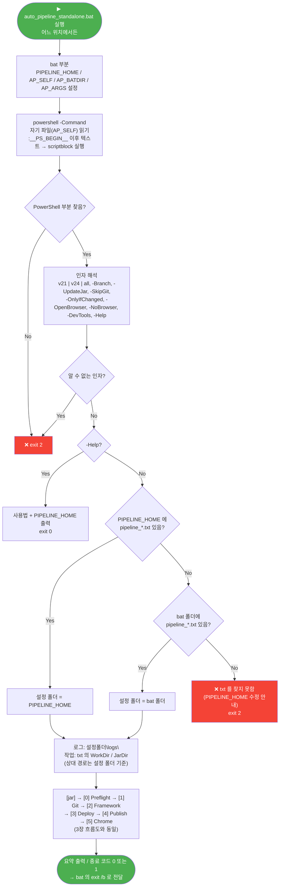

# AutoPipeline

(선택) 사내 서버에서 최신 Deploy JAVA 엔진을 받고, Git 서버에서 Nexacro N 엔진 소스를 받아 `nexacrolib`를 구성하고, Nexacro Deploy(JAVA CLI)로 프로젝트를 배포한 뒤, 결과물을 Tomcat에 게시하여 Chrome으로 실행하는 **무인 자동화 파이프라인**.

- 대상: **Nexacro N v21**, **Nexacro N v24**
- 기존 `Tools\*.bat` / `Tools\*.ps1` 은 **사용·수정하지 않음**. 모든 로직은 이 폴더 안의 새 파일에 있음
- 작성일: 2026-10-01

---

## 1. 사용법

실행 파일은 세 가지이며 **동작과 옵션이 같다**. 위치를 옮겨 쓸 경우 단일 파일 버전 또는 exe 를 사용한다 (10장, 13장).

| 실행 파일 | 구성 | 위치 |
|---|---|---|
| `auto_pipeline.bat` + `auto_pipeline.ps1` | bat 이 ps1 호출 | bat·ps1·txt 가 **같은 폴더**에 있어야 함 |
| `auto_pipeline_standalone.bat` | bat 한 파일에 PowerShell 포함 | **어디로 옮겨도 됨** (`PIPELINE_HOME` 으로 txt 폴더 지정) |
| `auto_pipeline.exe` | Python 이식 → Nuitka 로 네이티브 컴파일 (소스 미포함) | **어디로 옮겨도 됨** (`-Home` / `PIPELINE_HOME` / exe 폴더 / 기본 경로) |

```bat
auto_pipeline.bat            [v21|v24|all] [-Branch <name>] [-SourceType git|package] [-Build <folder>] [-UpdateJar] [-SkipGit] [-OnlyIfChanged] [-OpenBrowser|-NoBrowser] [-DevTools]
auto_pipeline_standalone.bat [v21|v24|all] [-Branch <name>] [-SourceType git|package] [-Build <folder>] [-UpdateJar] [-SkipGit] [-OnlyIfChanged] [-OpenBrowser|-NoBrowser] [-DevTools] [-Help]
```

| 인자 / 옵션 | 설명 |
|---|---|
| `v21` / `v24` / `all` | 실행 대상. 생략 시 `all` (v21 → v24 순차 실행) |
| `-Branch <이름>` | **이번 실행만** txt 의 `Branch` 대신 이 브랜치 사용 (txt 는 바뀌지 않음). `v21` / `v24` 처럼 대상 하나일 때만 가능 |
| `-SourceType git` / `package` | **이번 실행만** 소스 방식 변경. `git` = git 소스로 nexacrolib 구성(기본), `package` = 빌드된 `nexacrolib.zip` 사용 (12장) |
| `-Build <빌드 폴더>` | **이번 실행만** package 의 빌드 폴더 지정 (예: `-Build 2026.7.30.9(24.0.0.9991)`). 대상 하나일 때만 가능 |
| `-UpdateJar` | 서버의 최신 Deploy JAVA 엔진을 확인하여 `work\jar` 에 설치. 설치본과 같으면 다운로드 생략 |
| `-SkipGit` | 원격 확인 / clone / fetch / pull 생략 (현재 로컬 소스로 배포). SourceDir 가 git 저장소로 이미 있어야 함 |
| `-OnlyIfChanged` | 원격 커밋이 마지막 성공 이후 바뀌지 않았으면 해당 대상 건너뜀 (스케줄러용) |
| `-OpenBrowser` | 이번 실행만 Chrome 실행 (설정 `OpenBrowser=N` 이어도 실행) |
| `-NoBrowser` | 이번 실행만 Chrome 실행 안 함 (설정 `OpenBrowser=Y` 이어도 생략, `-OpenBrowser` 보다 우선) |
| `-DevTools` | Chrome 실행 시 개발자도구 자동 오픈 |

**Chrome 실행 여부 결정** — 기본은 **실행하지 않음**

| 우선순위 | 조건 | Chrome |
|---|---|---|
| 1 | `-NoBrowser` 지정 | 실행 안 함 |
| 2 | `-OpenBrowser` 지정 | 실행 |
| 3 | 설정 `OpenBrowser=Y` (`YES`/`TRUE`/`1` 도 가능) | 실행 |
| 4 | 설정 `OpenBrowser=N` 또는 키 없음 | 실행 안 함 (기본) |

### 예시

```bat
rem v21만 실행 (기본: Chrome 실행 안 함)
auto_pipeline.bat v21

rem v21, v24 모두 실행 + Chrome 으로 결과 확인
auto_pipeline.bat all -OpenBrowser

rem 이번만 RELEASE 브랜치로 v21 배포 (D:\git\RELEASE\REL_... 가 없으면 full clone 후 진행)
auto_pipeline.bat v21 -Branch RELEASE/REL_26.05.19.00_21.0.0.2100

rem 소스 갱신 없이 v24 재배포 + Chrome + DevTools
auto_pipeline.bat v24 -SkipGit -OpenBrowser -DevTools

rem 스케줄러용: 엔진 최신화 + 새 커밋이 있을 때만 (설정이 Y 여도 브라우저 생략)
auto_pipeline.bat all -UpdateJar -OnlyIfChanged -NoBrowser
```

**대상별 실행 여부 (`Enabled`)** — 기본은 **실행**

각 `pipeline_<대상>.txt` 의 `Enabled` 로 v21 / v24 를 개별로 켜고 끈다.

| 설정 | 동작 |
|---|---|
| `Enabled=Y` / 키 없음 / 빈 값 | 실행 (기본) |
| `Enabled=N` (`NO` / `FALSE` / `0` 도 가능) | 건너뜀 → 요약에 `DISABLED` 표시 |

- `all` 은 물론 `v21` / `v24` 를 직접 지정해도 txt 의 `Enabled=N` 이 적용된다
- 꺼진 대상은 `[jar]` 엔진 확인 대상에서도 제외된다

종료 코드: 모든 대상이 `SUCCESS` / `UNCHANGED` / `DISABLED` 이고 Jar 단계가 실패하지 않았으면 `0`, 그 외 `1`.

---

## 2. 파일 구성

```
Tools\AutoPipeline\
├── auto_pipeline.bat      ← 실행 진입점 (인자 정리 후 ps1 호출)
├── auto_pipeline.ps1      ← 파이프라인 본체 (단계 0~5)
├── auto_pipeline_standalone.bat ← 단일 파일 버전 (bat + PowerShell 통합, 위치 이동 가능)
├── auto_pipeline.exe      ← Python 이식 + Nuitka 컴파일 버전 (13장)
├── python\
│   ├── auto_pipeline.py   ← exe 의 소스 (표준 라이브러리만 사용)
│   ├── build_exe.bat      ← Nuitka 빌드 스크립트 → build\auto_pipeline.exe → ..\auto_pipeline.exe 복사
│   └── build\             ← 빌드 결과
├── pipeline_v21.txt       ← v21 설정
├── pipeline_v24.txt       ← v24 설정
├── README.md              ← 이 문서
├── logs\                  ← 실행 로그 (yyyyMMdd_HHmmss_<대상>.log)
└── work\                  ← 작업 폴더 (실행 시 자동 생성)
    ├── jar\                         ← Deploy JAVA 엔진 (v21/v24 공용, [jar] 단계가 설치)
    │   ├── NexacroN_Deploy_JAVA_...\    (bin\start.bat, libs\*.jar, log4j2.xml)
    │   └── installed_package.txt    ← 설치된 서버 패키지 파일명 (최신 여부 비교용)
    ├── jar_staging\                 ← 다운로드 임시 폴더 (성공 시 삭제)
    ├── v21\
    │   ├── nexacrolib\nexacrolib\   ← 엔진 소스에서 구성한 라이브러리 (-B)
    │   ├── nexacrolib\generate\     ← Generate/CSS Rule (-CSSRULE / -GENERATERULE)
    │   ├── output\<프로젝트명>\       ← 빌드 중간 산출물 (-O). 프로젝트명 = xprj 파일명 (예: TC_NexaV21)
    │   ├── deploy\                  ← 배포 결과물 (-D) → Tomcat 으로 미러링
    │   ├── chrome_profile\          ← v21 전용 Chrome 프로필
    │   └── last_success_hash_<브랜치>.txt ← 브랜치별 마지막 성공 커밋 (-OnlyIfChanged 비교용)
    └── v24\  (동일 구조)
```

**게시 위치 (Tomcat)**

| 대상 | 폴더 | URL |
|---|---|---|
| v21 | `apache-tomcat-11.0.25\webapps\auto_v21` | http://172.10.12.46:8080/auto_v21/index.html |
| v24 | `apache-tomcat-11.0.25\webapps\auto_v24` | http://172.10.12.46:8080/auto_v24/index.html |

> URL 은 `localhost` 가 아닌 **이 PC 의 IP** 로 만든다 (`ServerHost=auto`, 현재 `172.10.12.46`). 같은 네트워크의 다른 PC 에서도 같은 주소로 접속할 수 있다.

> 게시 위치는 설정의 `WebContext` / `PublishSubDir` 로 바꿀 수 있다 (5장 참고).
> ⚠ 게시 폴더와 **같은 이름의 폴더가 이미 있으면 통째로 삭제한 뒤 새로 복사**한다.
> 예를 들어 `WebContext=nexacroN_v24`, `PublishSubDir=` 로 지정하면 기존 `webapps\nexacroN_v24` 전체가 지워진다.
> 단, `webapps` 밖이나 Tomcat 기본 앱 전체(`ROOT`, `manager`, `host-manager`, `docs`, `examples`)는 거부한다.

---

## 3. 전체 흐름도

```mermaid
flowchart TD
    A([▶ auto_pipeline.bat 실행]) --> A1["auto_pipeline.ps1 호출\n-Target v21 | v24 | all"]
    A1 --> A2["로그 시작\nlogs\yyyyMMdd_HHmmss_대상.log"]
    A2 --> J0{"🧰 [jar] (Enabled 대상만)\n-UpdateJar 지정\n또는 JarDir 에 엔진 없음?"}
    J0 -- No --> LOOP
    J0 -- Yes --> J1["서버 목록 조회\n최신 연도 폴더 → 이름 내림차순 첫 zip/jar"]
    J1 --> J2{"installed_package.txt\n== 서버 최신 파일명?"}
    J2 -- Yes --> J9["⏭ up to date\n(다운로드 생략)"]
    J2 -- No --> J3["jar_staging 에 다운로드\n1차 압축 해제 → 중첩 zip 2차 해제"]
    J3 --> J4{"start.bat 있음?"}
    J4 -- No --> J8["❌ jar FAIL\n기존 엔진 유지"]
    J4 -- Yes --> J5["work\jar 교체\ninstalled_package.txt 기록\nstaging 삭제"]
    J5 --> LOOP
    J9 --> LOOP
    J8 --> LOOP
    LOOP{{"대상 반복\n(all = v21 → v24 순차)"}}

    LOOP --> CFG["pipeline_대상.txt 읽기\n필수 키 검사"]
    CFG --> CFG1{누락 키?}
    CFG1 -- 있음 --> FAIL
    CFG1 -- 없음 --> EN{"Enabled=N ?\n(기본 Y)"}
    EN -- Yes --> DIS["⏭ DISABLED\n(이 대상 건너뜀)"]
    EN -- No --> S0

    %% Step 0
    S0["🔍 [0] Preflight\nBranch 결정 (-Branch > txt) / SourceDir 의 {Branch} 치환\nProjectPath / TomcatHome 존재\n게시 폴더 확인 (webapps 안, Tomcat 기본 앱 전체 아님)\nJAVA_HOME\bin\java.exe 확인\nJar\**\start.bat 탐색 → JarRoot\nChrome 실행 여부 결정 (실행 시 chrome.exe 확인)"]
    S0 --> S0R{통과?}
    S0R -- No --> FAIL
    S0R -- Yes --> ST{"SourceType?\n(-SourceType > txt, 기본 git)"}
    ST -- git --> S1
    ST -- package --> PK["📦 [1] Package (12장)\nzip 위치 결정 → 로컬 캐시 복사\n→ nexacrolib\ + generate\ 압축 해제\n→ 버전 확인 (BOM 변환 없음)"]
    PK --> PKr{성공?}
    PKr -- No --> FAIL
    PKr -- "같은 zip & -OnlyIfChanged" --> UNCH
    PKr -- Yes --> S3

    %% Step 1
    S1{"📥 [1] Source\n-SkipGit?"}
    S1 -- Yes --> S1e
    S1 -- No --> S1a{"1-a 브랜치명 버전(NN.0.0.N)\n== ExpectedVersion?"}
    S1a -- 다름 --> FAIL
    S1a -- 같음/없음 --> S1b["1-b git ls-remote --heads RepoUrl 브랜치\n(약 1초)"]
    S1b --> S1b2{원격에 브랜치 있음?}
    S1b2 -- No --> FAIL
    S1b2 -- Yes --> S1c{"-OnlyIfChanged\n& 원격 해시 == 브랜치별 마지막 성공?"}
    S1c -- Yes --> UNCH["⏭ UNCHANGED\n(clone/fetch 없이 건너뜀)"]
    S1c -- No --> S1s{"1-c SourceDir 상태"}
    S1s -- "없음 / 빈 폴더" --> S1n["디스크 여유 확인 (기본 40GB)\ngit clone -c core.longpaths=true\n-b 브랜치 --single-branch RepoUrl SourceDir"]
    S1n --> S1nr{clone 성공?}
    S1nr -- No --> S1nx["이번에 만든 폴더만 삭제"] --> FAIL
    S1nr -- Yes --> S1e
    S1s -- "git 아님 (내용 있음)" --> FAIL
    S1s -- "git 저장소" --> S1u{"origin == RepoUrl\n& index.lock 없음\n& 현재 브랜치 == 브랜치\n& 로컬 수정 없음?"}
    S1u -- No --> FAIL
    S1u -- Yes --> S1p["git fetch origin 브랜치\ngit pull --ff-only origin 브랜치"]
    S1p --> S1e["1-d Lib\FrameworkJS\nexacrolib.json\nTools\Lib\TiMetainfoLib\res 확인\n커밋 해시 / 메시지 기록"]
    S1e --> S2

    %% Step 2
    S2["📦 [2] Framework copy\nwork\대상\nexacrolib 초기화\nLib\FrameworkJS\{component,framework,resources}\n+ nexacrolib.json 복사"]
    S2 --> S2a{"nexacrolib.json version 앞 2자리\n== ExpectedVersion?"}
    S2a -- No --> FAIL
    S2a -- Yes --> S2b["JS 파일 UTF-8 BOM 변환"]
    S2b --> S2c{ExpectedVersion}
    S2c -- 21 --> S2d["generate ← TiMetainfoLib\res"]
    S2c -- 24 --> S2e["generate ← TiMetainfoLib\res\n+ TiGenerateLib\Template\24"]
    S2d --> S3
    S2e --> S3

    %% Step 3
    S3["⚙️ [3] Deploy\noutput\프로젝트명 / deploy 초기화\njava -classpath JarRoot\libs\*\ncom.nexacro.build.cli.Main\n-P -B -O RULE -D + -MERGE -COMPRESS"]
    S3 --> S3a{"v21: -CSSRULE\nv24: -GENERATERULE"}
    S3a --> S3b{"exit code 0\n& deploy 폴더에 파일 있음?"}
    S3b -- No --> FAIL
    S3b -- Yes --> S4

    %% Step 4
    S4{"🌐 [4] Publish\nTomcat 포트 LISTEN?"}
    S4 -- No --> S4a["catalina.bat start\n최대 60초 대기"]
    S4a --> S4b{기동됨?}
    S4b -- No --> FAIL
    S4b -- Yes --> S4c
    S4 -- Yes --> S4x{"같은 이름 폴더\n이미 있음?"}
    S4x -- Yes --> S4y["🗑 기존 폴더 전체 삭제\n(삭제 파일 수 로그)"]
    S4x -- No --> S4c
    S4y --> S4c["robocopy /E\ndeploy → webapps\WebContext\PublishSubDir"]
    S4c --> S4d["시작 페이지 결정\nStartPage → index.html → 첫 *.html"]
    S4d --> S4e{"HTTP 200\n(최대 60초)?"}
    S4e -- No --> FAIL
    S4e -- Yes --> S5

    %% Step 5
    S5{"🖥 [5] Chrome 실행?\n-NoBrowser → 안 함\n-OpenBrowser → 실행\n그 외 OpenBrowser=Y|N (기본 N)"}
    S5 -- 안 함 --> OK
    S5 -- 실행 --> S5a["chrome.exe\n--user-data-dir=work\대상\chrome_profile\n--disk-cache-size=1 --new-window URL"]
    S5a --> OK

    OK["✅ SUCCESS\nlast_success_hash_브랜치.txt 갱신"] --> NEXT
    UNCH --> NEXT
    DIS --> NEXT
    FAIL["❌ FAIL\n오류 메시지 기록"] --> NEXT
    NEXT{다음 대상?} -- 있음 --> LOOP
    NEXT -- 없음 --> SUM["📋 요약 출력\n대상별 상태 / 버전 / 커밋 / URL / 단계별 시간"]
    SUM --> END([종료 코드: FAIL 있으면 1, 없으면 0])

    style A fill:#4CAF50,color:#fff
    style END fill:#4CAF50,color:#fff
    style OK fill:#4CAF50,color:#fff
    style FAIL fill:#f44336,color:#fff
    style UNCH fill:#9E9E9E,color:#fff
    style DIS fill:#9E9E9E,color:#fff
    style J8 fill:#f44336,color:#fff
    style J9 fill:#9E9E9E,color:#fff
```



---

## 4. 단계별 상세

### [jar] Deploy JAVA 엔진 설치 / 갱신

대상(v21/v24) 처리 전에 **실행당 1회** 수행. `Tools\update_jar.ps1` 과 같은 서버·같은 선택 규칙을 쓰지만, 이 폴더 안에 새로 구현했다.

**실행 조건**
- `-UpdateJar` 지정 시
- 또는 설정의 `JarDir` 에 `start.bat` 이 없을 때 (최초 실행 시 자동 설치)

**동작**

```
[1] http://59.10.169.82:9900/NexacroN/serverN/Deploy_JAVA/분리_Jar/ 목록에서 최신 연도(YYYY) 폴더 선택
[2] 연도 폴더 안의 .zip/.jar 를 이름 내림차순 정렬 → 첫 번째 = 최신
[3] work\jar\installed_package.txt 의 파일명과 같고 start.bat 이 있으면 → 다운로드 생략 (up to date)
[4] work\jar_staging\download.zip 으로 다운로드 → level1 에 1차 압축 해제
[5] level1 안의 중첩 zip 을 pkg 에 2차 해제, 그 외 파일(.json 등)은 pkg 로 이동
[6] pkg 에 start.bat 이 없으면 FAIL (work\jar 는 건드리지 않음)
[7] work\jar 비우고 pkg 내용 이동 → installed_package.txt 기록 → jar_staging 삭제
```

**기존 `update_jar.ps1` 과의 차이**

| 항목 | `Tools\update_jar.ps1` | AutoPipeline `[jar]` |
|---|---|---|
| 설치 위치 | `Tools\Jar` | `AutoPipeline\work\jar` (`Tools\Jar` 는 건드리지 않음) |
| 기존 엔진 삭제 시점 | 다운로드 **전** (실패 시 엔진 없음) | 다운로드·검증 **후** (실패 시 기존 엔진 유지) |
| 최신 여부 확인 | 없음 (항상 다운로드) | `installed_package.txt` 비교 후 같으면 생략 |
| 설치 검증 | 없음 | `start.bat` 존재 확인 |
| 단일 서브폴더 평탄화 | 수행 | 생략 (start.bat 을 재귀 탐색하므로 불필요) |

- `JarDir` 가 `AutoPipeline\work` 밖(예: `Tools\Jar`)이면 갱신을 거부한다 (기존 폴더 보호)
- Jar 단계가 실패해도 기존 엔진이 있으면 대상 처리는 그 엔진으로 계속 진행되며, 최종 종료 코드는 1

### [0] Preflight — 사전 점검

| 점검 항목 | 실패 시 |
|---|---|
| `ProjectPath`, `TomcatHome` 경로 존재 (`SourceDir` 는 없을 수 있으므로 [1] 에서 처리) | FAIL |
| 게시 폴더가 `webapps` 안인지 (`..` 등으로 밖을 가리키면 거부) | FAIL |
| `PublishSubDir` 가 비어 있을 때 `WebContext` 가 Tomcat 기본 앱(`ROOT`, `manager`, `host-manager`, `docs`, `examples`)이 아닌지 | FAIL |
| `JavaHome`(설정) 또는 `%JAVA_HOME%` 의 `bin\java.exe` 존재 | FAIL |
| `JarDir` 하위에서 `start.bat` 재귀 탐색 → 상위 폴더를 `JarRoot` 로 사용 | FAIL (`-UpdateJar` 실행 안내) |
| Chrome 실행 여부 결정 (1장 표). 실행하는 경우에만 `chrome.exe` 존재 확인 | FAIL |

현재 환경에서 사용되는 값:
- Java: `C:\Program Files\Microsoft\jdk-25.0.4.101-hotspot` (시스템 `JAVA_HOME`, JDK 25)
- Jar: `AutoPipeline\work\jar\NexacroN_Deploy_JAVA_20260825(1.1.90)_1`

### [1] Source — 엔진 소스 준비 (없으면 clone, 있으면 업데이트)

**브랜치 / 폴더 결정** ([0] 이전)

| 우선순위 | 브랜치 |
|---|---|
| 1 | 실행 옵션 `-Branch <이름>` (이번 실행만) |
| 2 | txt 의 `Branch=` |

`SourceDir=D:\git\{Branch}` 의 `{Branch}` 를 브랜치명으로 바꾸고, `/` 는 하위 폴더(`\`)가 된다.

| Branch | SourceDir | 비고 |
|---|---|---|
| `master` / `main` / `master_21` / `main_21` | `D:\git\master` 등 | 기존 폴더 그대로 사용 |
| `RELEASE/REL_26.05.19.00_21.0.0.2100` | `D:\git\RELEASE\REL_26.05.19.00_21.0.0.2100` | 브랜치마다 새 폴더 (git_sourcecode.md 와 같은 규칙) |
| `FEATURE/...` | `D:\git\FEATURE\...` | 브랜치마다 새 폴더 |

**처리 순서**

```
1-a 브랜치명 버전 사전 검사
    브랜치명의 마지막 '_NN.0.0.N' 앞 2자리가 ExpectedVersion 과 다르면 FAIL (clone 전에 차단)
    예) v21 에 RELEASE/REL_26.08.25.00_24.0.0.1100 → "is v24 but ExpectedVersion=21"
    날짜(26.05.19.00, 22.11.01.01)는 버전으로 보지 않음. 버전이 없는 이름(master_21, FEATURE/...)은 검사 생략

1-b git ls-remote --heads <RepoUrl> refs/heads/<Branch>      (약 1초)
    결과 없음 → FAIL "Branch not found on remote"
    -OnlyIfChanged 이고 원격 해시 == last_success_hash_<브랜치>.txt → UNCHANGED (clone/fetch 하지 않음)

1-c SourceDir 상태별 처리
```

| SourceDir 상태 | 처리 |
|---|---|
| 없음 / 빈 폴더 | 디스크 여유 확인(`CloneMinFreeGB`, 기본 40GB) → **full clone**<br>`git clone -c core.longpaths=true -b <Branch> --single-branch <RepoUrl> <SourceDir>`<br>실패 시 이번 실행에서 만든 폴더만 삭제 |
| git 저장소 | `origin` == `RepoUrl` / `.git\index.lock` 없음 / 현재 브랜치 == Branch / 로컬 수정 없음 확인 후<br>`git fetch origin <Branch>` → `git pull --ff-only origin <Branch>` |
| git 저장소인데 origin 이 다름 | FAIL (다른 저장소 보호) |
| git 저장소인데 브랜치가 다름 | FAIL (브랜치별 폴더 규칙 위반, `SourceDir=...\{Branch}` 안내) |
| 내용이 있는데 git 아님 | FAIL (**삭제하지 않음**) |

```
1-d 필수 경로 확인: Lib\FrameworkJS\nexacrolib.json, Tools\Lib\TiMetainfoLib\res
    커밋 해시 / 메시지 기록 → [2]
```

- clone 명령은 `git_sourcecode.md` 의 명령과 같고, Windows 긴 경로(260자) 대응 `core.longpaths=true` 만 추가했다
- **처음 clone 은 약 7~9GB 다운로드 + 약 20GB 체크아웃**이라 수십 분 걸릴 수 있다 (시간 제한 없음). 이후 실행은 fetch/pull 만 한다
- `GIT_TERMINAL_PROMPT=0` 으로 인증 프롬프트 대기를 막음 (인증 실패 시 즉시 FAIL)
- `RepoUrl` 이 없으면 clone 하지 않고, 기존 SourceDir 의 `origin` 으로 원격 확인/업데이트만 한다
- TFS 서버는 partial clone(`--filter`)을 지원하지 않는다 (프로토콜 v0, `filter` capability 없음). `--depth`(shallow)는 지원

### [2] Framework copy — nexacrolib / generate 구성

```
SourceDir\Lib\FrameworkJS\component        → work\<대상>\nexacrolib\nexacrolib\component
SourceDir\Lib\FrameworkJS\framework        → work\<대상>\nexacrolib\nexacrolib\framework
SourceDir\Lib\FrameworkJS\resources        → work\<대상>\nexacrolib\nexacrolib\resources
SourceDir\Lib\FrameworkJS\nexacrolib.json  → work\<대상>\nexacrolib\nexacrolib\nexacrolib.json
```

1. `work\<대상>\nexacrolib` 전체 삭제 후 재생성
2. 위 복사 (`robocopy /E`)
3. **버전 검증**: `nexacrolib.json` 의 `"version"` 앞 2자리가 `ExpectedVersion` 과 다르면 FAIL
   (잘못된 브랜치/폴더 지정 방지)
4. `nexacrolib\nexacrolib` 하위 모든 `.js` 를 UTF-8 BOM 으로 변환 (이미 BOM 이면 건너뜀)
5. Generate Rule 구성

| 버전 | `work\<대상>\nexacrolib\generate` 구성 |
|---|---|
| v21 | `Tools\Lib\TiMetainfoLib\res` |
| v24 | `Tools\Lib\TiMetainfoLib\res` + `Tools\Lib\TiGenerateLib\Template\24` |

### [3] Deploy — Nexacro Deploy JAVA CLI

`start.bat` 은 끝에 `pause` 가 있어 무인 실행이 멈추므로 **Java 를 직접 호출**한다.

```
java.exe -Dlog4j.configurationFile=<JarRoot>\log4j2.xml
         -classpath <JarRoot>\libs\*
         com.nexacro.build.cli.Main
         -P <ProjectPath>
         -B work\<대상>\nexacrolib\nexacrolib
         -O work\<대상>\output\<프로젝트명>         ← 프로젝트명 = xprj 파일명 (TC_NexaV21 / JEBI_TOPS_V24)
         <RULE> work\<대상>\nexacrolib\generate     ← v21: -CSSRULE / v24: -GENERATERULE
         -D work\<대상>\deploy
         -MERGE -COMPRESS                           ← 설정 파일의 '-' 플래그
```

- `output\<프로젝트명>`, `deploy` 폴더는 매번 삭제 후 재생성 (`work\<대상>` 밖은 삭제 불가하도록 가드)
  - `output` 아래 다른 프로젝트 폴더는 건드리지 않음
- 종료 코드가 0 이 아니거나 `deploy` 폴더가 비어 있으면 FAIL

| 대상 | ProjectPath |
|---|---|
| v21 | `D:\nexacro UI\TC_NexaV21\TC_NexaV21.xprj` |
| v24 | `D:\nexacro UI\JEBI_TOPS_V24\JEBI_TOPS_V24.xprj` |

### [4] Publish — Tomcat 게시

1. `TomcatPort`(8080) LISTEN 확인. 이미 실행 중이면 **재시작하지 않음**
2. 꺼져 있으면 `catalina.bat start` (JAVA_HOME = 위 Java) 후 최대 60초 대기
3. 게시 폴더 결정: `TomcatHome\webapps\<WebContext>[\<PublishSubDir>]` (`{Project}` → 프로젝트명 치환)
4. **같은 이름의 폴더가 이미 있으면 전체 삭제** (삭제한 파일 수를 로그에 기록). 누가 만든 폴더인지 구분하지 않는다
5. `robocopy /E work\<대상>\deploy → 게시 폴더` 로 새로 복사
6. 시작 페이지 결정: 설정 `StartPage` → `index.html` → deploy 루트의 첫 `*.html`
7. URL 호스트 결정: 설정 `ServerHost` 값. 비우거나 `auto` 이면 **이 PC 의 IPv4 자동 탐색**
   - 기본 게이트웨이가 있는 활성 어댑터의 IPv4 (현재 `이더넷` → `172.10.12.46`)
   - 없으면 `127.*` / `169.254.*` 를 제외한 첫 IPv4, 그것도 없으면 `localhost`
8. `http://<호스트>:<TomcatPort>/...` 가 HTTP 200 을 반환할 때까지 최대 60초 대기 (Tomcat 자동 배포 지연 대응). Chrome 도 같은 주소로 연다

**게시 위치 / URL 예시** (프로젝트 `TC_NexaV21`, `ServerHost=auto` → `172.10.12.46`)

| `WebContext` | `PublishSubDir` | 게시 폴더 (`webapps\...`) | URL | 판정 |
|---|---|---|---|---|
| `auto_v21` | (비움) | `auto_v21` | http://172.10.12.46:8080/auto_v21/index.html | 허용 (현재 설정, 있으면 삭제 후 복사) |
| `auto_v21` | `{Project}` | `auto_v21\TC_NexaV21` | http://172.10.12.46:8080/auto_v21/TC_NexaV21/index.html | 허용 |
| `nexacroN_v21` | `{Project}` | `nexacroN_v21\TC_NexaV21` | http://172.10.12.46:8080/nexacroN_v21/TC_NexaV21/index.html | 허용 (하위 폴더만 교체) |
| `nexacroN_v21` | (비움) | `nexacroN_v21` | http://172.10.12.46:8080/nexacroN_v21/index.html | 허용 ⚠ **기존 `nexacroN_v21` 전체 삭제** |
| `ROOT` | `{Project}` | `ROOT\TC_NexaV21` | http://172.10.12.46:8080/TC_NexaV21/index.html | 허용 (ROOT 는 URL 에서 생략) |
| `ROOT` | (비움) | `ROOT` | — | **거부** (Tomcat 기본 앱 전체) |

### [5] Chrome — 실행 (선택)

기본은 실행하지 않는다. `OpenBrowser=Y` 또는 `-OpenBrowser` 일 때만 아래와 같이 실행한다 (`-NoBrowser` 가 최우선).

```
chrome.exe --user-data-dir="work\<대상>\chrome_profile"
           --no-first-run --no-default-browser-check
           --disk-cache-size=1 --new-window
           [--auto-open-devtools-for-tabs]
           http://<ServerHost>:8080/<WebContext>/<PublishSubDir>/<StartPage>
```

- 버전별 **전용 프로필** 사용 → 평소 Chrome 과 분리, 캐시로 인한 이전 빌드 노출 방지, v21/v24 동시 실행 가능

---

## 5. 설정 파일 (`pipeline_v21.txt` / `pipeline_v24.txt`)

`키=값` 형식. `#` 은 주석, `-` 로 시작하는 줄은 Deploy CLI 플래그로 그대로 전달.

```ini
# AutoPipeline config - Nexacro N v21
# Run this target: Y | N (default Y). N = skipped even when run as 'v21' or 'all'.
Enabled=Y
ExpectedVersion=21
# Source: cloned from RepoUrl (full, single-branch) when SourceDir does not exist.
# {Branch} -> branch name, '/' becomes a sub folder (RELEASE/x -> D:\git\RELEASE\x).
# Branch can be overridden for one run: auto_pipeline*.bat v21 -Branch <name>
RepoUrl=https://tfs2.tobesoft.com:9443/tfs/XPLATFORM/_git/WORK800
SourceDir=D:\git\{Branch}
Branch=master_21
ProjectPath=D:\nexacro UI\TC_NexaV21\TC_NexaV21.xprj
WorkDir=D:\git\cursor_project\Tools\AutoPipeline\work\v21
JarDir=D:\git\cursor_project\Tools\AutoPipeline\work\jar
TomcatHome=C:\Users\tobesoft\cursor\apache-tomcat-11.0.25
TomcatPort=8080
# URL host: auto (= this PC's IPv4) or a fixed IP / host name
ServerHost=auto
# Publish -> TomcatHome\webapps\<WebContext>\<PublishSubDir>  ({Project} = xprj file name)
# URL     -> http://<ServerHost>:<TomcatPort>/<WebContext>/<PublishSubDir>/<StartPage>
WebContext=auto_v21
PublishSubDir=
StartPage=
# Open Chrome after publish: Y | N (default N). -OpenBrowser / -NoBrowser override.
OpenBrowser=N
ChromePath=C:\Program Files\Google\Chrome\Application\chrome.exe
-MERGE
-COMPRESS
```

| 키 | 필수 | 설명 |
|---|---|---|
| `Enabled` | ➖ | 이 대상 실행 여부 `Y` / `N`. **비우거나 없으면 `Y` (실행)**. `N` 이면 `DISABLED` 로 건너뜀 |
| `ExpectedVersion` | ✅ | `21` / `24`. 버전 검증, RULE 옵션, Template\24 복사 여부 결정 |
| `RepoUrl` | ➖ | 엔진 소스 git 저장소 주소. 있으면 SourceDir 가 없을 때 **full clone**. 없으면 기존 SourceDir 의 origin 으로 업데이트만 |
| `SourceDir` | ✅ | 엔진 소스 폴더. `{Branch}` 토큰 사용 가능 (`D:\git\{Branch}` → `D:\git\master_21`, `D:\git\RELEASE\REL_...`) |
| `Branch` | ✅ | 받을 / 업데이트할 브랜치. 실행 옵션 `-Branch` 가 있으면 그 값이 우선 (이번 실행만) |
| `CloneMinFreeGB` | ➖ | clone 전에 필요한 디스크 여유 공간(GB). 기본 `40` |
| `SourceType` | ➖ | `git`(기본) / `package`. `-SourceType` 이 우선 (이번 실행만) |
| `PackageRoot` | ➖ | package 공유 폴더 루트. 예: `\\59.10.169.25\Deploy_v24\Total_Package` (v21 은 미정, 비어 있음) |
| `PackageBuild` | ➖ | `latest`(기본, 가장 최근 빌드) 또는 빌드 폴더 이름. `-Build` 가 우선 |
| `PackageZip` | ➖ | 사용할 zip 이름. 기본 `nexacrolib.zip` |
| `PackagePath` | ➖ | zip 파일 또는 빌드 폴더의 전체 경로. 지정하면 `PackageRoot` / `PackageBuild` / `-Build` 보다 우선 |
| `ProjectPath` | ✅ | 배포할 `.xprj` |
| `WorkDir` | ✅ | 버전별 작업 폴더. 삭제 작업은 이 폴더 안에서만 허용 |
| `JarDir` | ✅ | Deploy JAVA 엔진 폴더. `[jar]` 단계로 갱신하려면 `AutoPipeline\work` 안이어야 함 |
| `TomcatHome` | ✅ | Tomcat 루트 |
| `TomcatPort` | ✅ | Tomcat HTTP 포트 (`conf\server.xml` 기준 8080) |
| `ServerHost` | ➖ | URL 호스트. **비우거나 `auto` 이면 이 PC 의 IPv4 자동 탐색**. 고정하려면 `172.10.12.46` 처럼 IP 지정 (`localhost` 도 가능) |
| `WebContext` | ✅ | `webapps` 아래 컨텍스트 폴더명 (URL 첫 경로). `ROOT` 이면 URL 에서 생략. `{Project}` 사용 가능 |
| `PublishSubDir` | ➖ | 컨텍스트 안 하위 폴더. 비우면 컨텍스트 루트에 게시. `{Project}` 사용 가능 (예: `{Project}`, `test\{Project}`) |
| `StartPage` | ➖ | 비우면 자동 탐색 (`index.html` → 첫 `*.html`) |
| `OpenBrowser` | ➖ | 게시 후 Chrome 실행 여부 `Y` / `N`. **비우거나 없으면 `N` (실행 안 함)**. `-OpenBrowser` / `-NoBrowser` 가 우선 |
| `ChromePath` | ➖ | 비우면 `C:\Program Files\Google\Chrome\Application\chrome.exe` |
| `JavaHome` | ➖ | 비우면 시스템 `%JAVA_HOME%` 사용 |
| `-MERGE` / `-COMPRESS` / `-SHRINK` | ➖ | Deploy CLI 옵션 |

---

## 6. 기존 Tools 스크립트 대신 새로 만든 이유 (검토 결과)

기존 스크립트를 연결하는 방식을 검토하면서 아래 문제를 확인했고, 그래서 독립 파이프라인으로 새로 작성했다. **기존 파일은 그대로 두었다.**

| # | 기존 스크립트 | 문제 | AutoPipeline 의 처리 |
|---|---|---|---|
| 1 | `update_framework_v3.bat` | `get_version.ps1` / `convert_utf8bom.ps1` / `update_version.ps1` 이 `param()` 방식으로 바뀌었는데 bat 은 여전히 환경변수로 전달 → 버전 감지 실패 시 **v21 에도 Template\24 복사**, BOM 변환이 **현재 작업 폴더**를 대상으로 동작 | 함수로 내장, 경로를 명시적으로 전달 |
| 2 | `run_Deploy.bat` 12단계 | 버전과 무관하게 `"21.0.0.9999"` → `"24.0.0.9999"` 치환 → v21 결과물 오염 | 해당 단계 없음 (게시용 산출물에는 불필요) |
| 3 | 두 스크립트 | `pause`, config 다중 선택 프롬프트 → 무인 실행 중단 | 프롬프트 없음 |
| 4 | `deploy_config*.txt` | 존재하지 않는 `D:\git_prj\...`, `E:\git\extension2\WORK800` 경로 / `SourceDir` 1개만 지원 | 버전별 설정 파일, 실제 경로 사용 |
| 5 | 공유 폴더 | v21/v24 가 `cursor_project\nexacrolib` 를 덮어씀 | `work\v21`, `work\v24` 로 분리 |
| 6 | 게시 | 기존 `webapps\nexacroN_v21/v24` 덮어쓰기 위험 | 설정으로 위치 지정, 같은 이름 폴더는 삭제 후 복사, `webapps` 밖·Tomcat 기본 앱 전체는 금지 |
| 7 | `update_jar.ps1` | 다운로드 전에 기존 엔진 삭제, 항상 재다운로드 | staging 후 교체, 동일 버전 생략 (`[jar]` 단계) |

> `run_Deploy.bat` 의 `deploy_engine` 구성 / zip 압축(9~13단계)은 엔진 배포 패키지를 만드는 용도라 이 파이프라인에는 포함하지 않았다.

---

## 7. 실행 결과 (2026-10-01 최초 실행)

| 대상 | 결과 | 버전 | 커밋 | 소요 시간 |
|---|---|---|---|---|
| v21 | ✅ SUCCESS | 21.0.0.9999 | `3b64f73` RP 106324 Chrome(System WebView) 154 ... | Git 4.4s / Copy 9s / Deploy 47.7s / Publish 2.2s |
| v24 | ✅ SUCCESS | 24.0.0.9999 | `1a69f17` RP 106325 Chrome(System WebView) 154 ... | Git 15.6s / Copy 13.9s / Deploy 84.6s / Publish 5.6s |

- v21: 배포 파일 156개, 오류 0건 → http://localhost:8080/auto_v21/index.html
- v24: 생성 성공 250 / **실패 2**, 배포 성공 667 / 실패 0 → http://localhost:8080/auto_v24/index.html
  - 실패 2건은 프로젝트에 등록된 화면 파일이 실제로 없어서 발생 (파이프라인 문제 아님)
    ```
    [ERROR] Cannot find the file : "TestSample_QC::RP_100712_stepForm.xfdl"
    [ERROR] Cannot find the file : "TestSample_QC::RP_99021_div_test.xfdl"
    ```
- 기존 `webapps\nexacroN_v24`(1,440 파일), `webapps\nexacroN_v21`(150 파일) 변경 없음 확인

**`[jar]` 단계 추가 후 확인 (v21, `-UpdateJar -SkipGit -NoBrowser`)**

| 실행 | Jar 결과 | v21 |
|---|---|---|
| 1회차 (`work\jar` 비어 있음) | `NexacroN_Deploy_JAVA_20260825(1.1.90)_1.zip` 다운로드·설치 (2.1s) | SUCCESS (배포 Fail 0) |
| 2회차 | 서버 최신 = 설치본 → `up to date`, 다운로드 생략 | SUCCESS |

- `Tools\Jar` 변경 없음 확인

---

## 8. 알려진 제한 / 주의 사항

- **Deploy CLI 는 일부 화면 생성 실패에도 종료 코드 0 을 반환**한다 (위 v24 사례). 현재는 로그의 `[ERROR]` 줄로만 확인 가능하다.
- `-OnlyIfChanged` 는 마지막 **성공** 해시와 비교한다. 실패한 커밋은 다음 실행에서 다시 시도된다.
- `git pull --ff-only` 이므로 로컬 브랜치가 원격과 갈라져 있으면 FAIL 처리된다 (자동 merge 하지 않음).
- 작업 스케줄러로 실행할 때는 TFS 자격 증명이 Windows 자격 증명 관리자에 저장되어 있어야 한다.
- `all` 실행 시 v21 이 실패해도 v24 는 계속 진행되며, 최종 종료 코드는 1 이 된다.

---

## 9. 문제 해결

| 증상 | 확인 |
|---|---|
| `Path not found` | `pipeline_<대상>.txt` 의 경로 |
| `start.bat not found under ...jar` | `-UpdateJar` 로 실행 |
| `[jar] FAIL - ...` | 사내 서버(`59.10.169.82:9900`) 접속 여부. 기존 엔진이 있으면 그대로 사용됨 |
| `JarDir must be under ...work` | `JarDir` 를 `AutoPipeline\work\jar` 로 지정 |
| `Refusing to replace Tomcat built-in app` | `ROOT` 등 기본 앱 전체를 지정함. `PublishSubDir` 로 하위 폴더를 지정 |
| 게시 중 `Remove-Item` 오류 (파일 사용 중) | 해당 폴더의 파일을 다른 프로그램이 열고 있음. 닫고 재실행 |
| `Source repo has local changes` | `SourceDir` 에서 `git status` 로 수정 파일 정리 |
| `Branch '...' is vNN but ExpectedVersion=..` | 다른 버전의 브랜치를 지정함. v21 은 `_21.0.0.N`, v24 는 `_24.0.0.N` 브랜치 사용 |
| `Branch not found on remote` | 브랜치명 철자 (`git ls-remote --heads <RepoUrl>` 로 목록 확인) |
| `SourceDir is on branch 'x', expected 'y'` | 고정 SourceDir 에 다른 브랜치를 지정함. `SourceDir=D:\git\{Branch}` 사용 |
| `SourceDir origin ... differs from RepoUrl` | SourceDir 가 다른 저장소의 clone 임. 경로 또는 RepoUrl 확인 |
| `SourceDir exists but is not a git repository` | 그 폴더에 git 이 아닌 파일이 있음 (삭제하지 않음). 비우거나 다른 경로 지정 |
| `index.lock exists` | 다른 git 작업이 진행 중이거나 비정상 종료됨. 확인 후 `.git\index.lock` 삭제 |
| `Not enough disk space to clone` | 드라이브 여유 공간 확보 또는 `CloneMinFreeGB` 조정 |
| `git clone failed` | 네트워크 / 인증 / 경로. 만든 폴더는 자동 삭제되므로 그대로 재실행 가능 |
| `SourceType=package needs PackageRoot or PackagePath` | txt 에 `PackageRoot` 또는 `PackagePath` 지정 (v21 은 아직 미정) |
| `Package branch folder not found` | `PackageRoot\<Branch 마지막 부분>` 폴더 확인 (`RELEASE/REL_x` → `REL_x`) |
| `Package zip not found` | 빌드 폴더 이름(`-Build` / `PackageBuild`) 과 `PackageZip` 확인 |
| `Unexpected package layout` | zip 최상위에 `nexacrolib\`, `generate\` 가 없음. zip 종류 확인 |
| `Version mismatch: package=...` | v21 / v24 에 맞지 않는 패키지. `PackageRoot` / 브랜치 확인 |
| `git fetch failed` | 네트워크 / TFS 인증 (`git -C <SourceDir> fetch` 직접 실행) |
| `Version mismatch` | `SourceDir` / `Branch` 가 `ExpectedVersion` 과 맞는지 |
| `Deploy failed (exit N)` | 로그의 Java 출력 |
| `URL not ready within 60s` | Tomcat 로그 (`TomcatHome\logs`), 시작 페이지 이름 (`StartPage` 지정) |
| `pipeline_v21.txt / pipeline_v24.txt not found` (standalone) | `auto_pipeline_standalone.bat` 맨 위 `set "PIPELINE_HOME=..."` 경로 확인 |
| `Unknown argument` (standalone) | 옵션 철자 확인 (`-Help` 로 목록 출력) |

로그 위치: `Tools\AutoPipeline\logs\yyyyMMdd_HHmmss_<대상>.log`

---

## 10. 단일 파일 버전 (`auto_pipeline_standalone.bat`)

`auto_pipeline.bat` + `auto_pipeline.ps1` 을 **bat 한 파일로 합친 버전**. bat 파일의 위치가 바뀌어도 동작하도록 만들었다.
기존 `auto_pipeline.bat` / `auto_pipeline.ps1` 은 그대로 유지되며, 두 방식 모두 같은 `pipeline_*.txt` 를 사용한다.

### 10-1. 파일 구조

```
auto_pipeline_standalone.bat
├── [bat 부분]  (cmd 가 실행)
│   ├── set "PIPELINE_HOME=D:\git\cursor_project\Tools\AutoPipeline"   ← txt 폴더 지정 (사용자 수정)
│   ├── AP_SELF / AP_BATDIR / AP_ARGS 환경변수 설정
│   ├── powershell -Command "자기 자신을 읽어 :__PS_BEGIN__ 아래를 실행"
│   └── exit /b %ERRORLEVEL%        ← cmd 는 여기서 끝나므로 아래 내용을 읽지 않음
└── [PowerShell 부분]  (:__PS_BEGIN__ 아래, PowerShell 이 실행)
    ├── 인자 해석 (v21|v24|all, -UpdateJar, -SkipGit, ...)
    ├── 설정 폴더 결정 (PIPELINE_HOME → bat 폴더)
    └── auto_pipeline.ps1 과 동일한 파이프라인 ([jar] → [0]~[5] → 요약)
```

### 10-2. 실행 흐름



### 10-3. 설정 폴더 (`PIPELINE_HOME`) 결정

bat 맨 위의 한 줄로 지정한다.

```bat
set "PIPELINE_HOME=D:\git\cursor_project\Tools\AutoPipeline"
```

| 순서 | 후보 | 사용 조건 |
|---|---|---|
| 1 | `PIPELINE_HOME` 에 적은 폴더 | 그 폴더에 `pipeline_v21.txt` 또는 `pipeline_v24.txt` 가 있음 |
| 2 | bat 파일이 있는 폴더 | 위가 아니고, bat 폴더에 `pipeline_*.txt` 가 있음 |
| — | 둘 다 아님 | 오류 종료 (exit 2), 확인한 두 경로 출력 |

- `logs\` 는 결정된 설정 폴더 아래에 생성된다
- Jar 갱신 허용 범위(`work\`)도 설정 폴더 기준이다

**사용 예**

| 상황 | 방법 |
|---|---|
| bat 만 바탕화면 등 다른 곳으로 복사 | 그대로 실행 (`PIPELINE_HOME` 이 AutoPipeline 폴더를 가리킴) |
| AutoPipeline 폴더를 통째로 이동 | bat 과 txt 가 같이 옮겨지므로 2순위(bat 폴더)로 자동 인식. 단, txt 의 절대 경로(`WorkDir` 등)는 수정 필요 → 상대 경로 권장 (10-4) |
| 설정 폴더를 여러 개 운영 | bat 을 복사해 각각 `PIPELINE_HOME` 만 다르게 지정 |

### 10-4. txt 의 상대 경로 지원 (standalone 전용)

`auto_pipeline_standalone.bat` 은 txt 의 아래 키가 **상대 경로이면 txt 가 있는 폴더 기준**으로 변환한다.

대상 키: `SourceDir`, `ProjectPath`, `WorkDir`, `JarDir`, `TomcatHome`, `JavaHome`, `ChromePath`

```ini
WorkDir=work\v21        → <설정 폴더>\work\v21
JarDir=work\jar         → <설정 폴더>\work\jar
```

> ⚠ 기존 `auto_pipeline.ps1` 은 상대 경로를 변환하지 않는다. 두 실행 파일을 같이 쓰려면 txt 는 지금처럼 **절대 경로를 유지**한다.

### 10-5. 기존 ps1 과의 차이

| 항목 | `auto_pipeline.ps1` | `auto_pipeline_standalone.bat` |
|---|---|---|
| 파일 수 | bat + ps1 (2개) | 1개 |
| 설정 폴더 | ps1 이 있는 폴더 고정 | `PIPELINE_HOME` → bat 폴더 |
| 인자 처리 | PowerShell `param()` | 직접 해석 (모르는 인자는 오류) |
| `-Help` | 없음 | 있음 |
| txt 상대 경로 | 미지원 | 지원 |
| 파이프라인 로직 | — | ps1 과 동일 |

**주의**
- 오류 메시지의 줄 번호는 bat 파일의 실제 줄 번호와 다르다 (PowerShell 부분만 기준으로 계산됨)
- 편집기에서 bat 으로 인식되어 PowerShell 문법 강조가 되지 않는다
- 파이프라인 로직을 수정할 때는 `auto_pipeline.ps1` 과 `auto_pipeline_standalone.bat` **양쪽을 같이 수정**해야 동작이 같게 유지된다
- PowerShell 부분은 ASCII 문자만 사용한다 (한글 주석을 넣으면 인코딩 문제가 생길 수 있음)
- 줄바꿈은 CRLF 로 저장한다

### 10-6. 확인 결과 (2026-10-01)

bat 을 AutoPipeline 폴더 밖(임시 폴더)으로 복사하여 실행.

| 테스트 | 결과 |
|---|---|
| `-Help` | 사용법 + `Config folder (PIPELINE_HOME): D:\git\cursor_project\Tools\AutoPipeline` 출력, exit 0 |
| `v21 -Foo` | `[ERROR] Unknown argument: -Foo`, exit 2 |
| `PIPELINE_HOME=D:\nowhere` + bat 폴더에 txt 없음 | 확인한 두 경로와 수정 안내 출력, exit 2 |
| `all -SkipGit -NoBrowser` | 설정 폴더 = AutoPipeline 인식, v21 SUCCESS (배포 Fail 0, `http://172.10.12.46:8080/nexacroN_v21/21.0.0.2100/TC_NexaV21/index.html`), v24 DISABLED, exit 0 |
| 상대 경로 (`WorkDir=work\v21`, `ProjectPath=..\proj\A.xprj`) | txt 폴더 기준 절대 경로로 변환됨 |

---

## 11. 소스 준비 (clone / 브랜치 지정) 확인 결과 (2026-10-01)

**서버 확인**

| 항목 | 결과 |
|---|---|
| 원격 브랜치 조회 (`ls-remote`) | 0.9초, 인증 프롬프트 없음. `master` / `main` / `master_21` / `main_21` / `RELEASE/REL_26.05.19.00_21.0.0.2100` / `RELEASE/REL_26.08.25.00_24.0.0.1100` 존재 |
| partial clone (`--filter=blob:none`) | **미지원** (프로토콜 v0, capability 에 `filter` 없음) |
| shallow (`--depth`) | 지원 |
| 기존 clone 크기 | `.git` 7~9GB + 작업 폴더 약 20GB (브랜치당) |

**동작 테스트**

| # | 테스트 | 결과 |
|---|---|---|
| T1 | `all -Branch main_21` (두 실행 파일) | `-Branch needs a single target`, exit 2 |
| T2 | `v21 -Branch RELEASE/REL_26.08.25.00_24.0.0.1100` | clone 전에 `is v24 but ExpectedVersion=21` 로 FAIL |
| T3 | `v21 -Branch RELEASE/NOT_EXIST_21` | `Branch not found on remote` 로 FAIL |
| T4 | `v21` (txt 기본 `master_21`, 기존 `D:\git\master_21`) | ls-remote → fetch → pull(`Already up to date`) → 배포·게시 SUCCESS |
| T5 | SourceDir 없음 → clone (작은 저장소로 대체 테스트) | `git clone -c core.longpaths=true -b main --single-branch` 수행, 브랜치 폴더 생성, `core.longpaths=true` 저장 확인 |
| T6 | T5 폴더로 재실행 | clone 하지 않고 fetch + pull |
| T7 | 기존 clone 인데 RepoUrl 다름 | `origin ... differs from RepoUrl` 로 FAIL, 폴더 유지 |
| T8 | 내용 있는 git 아닌 폴더 | `not a git repository (not touched)` 로 FAIL, 파일 유지 |
| T9 | `auto_pipeline.bat v21 -Branch master_21` | SUCCESS, `last_success_hash_master_21.txt` 기록 |

- 버전 사전 검사 규칙 확인: `RELEASE/REL_26.05.19.00_21.0.0.2100` → 21, `..._24.0.0.1100_AS` → 24, `FEATURE/.../GS_TUTORIAL_22.11.01.01`·`master_21` → 검사 생략
- WORK800 의 실제 full clone(약 27GB)은 테스트하지 않았다. 처음 RELEASE 브랜치를 지정해 실행할 때 수행된다
- 테스트 중 PowerShell `Remove-Item` 이 260자 넘는 경로를 지우지 못하는 문제를 발견하여, 폴더 삭제(작업 폴더 초기화 / 게시 폴더 교체 / clone 실패 정리 / jar staging)를 robocopy 기반 `Remove-Tree` 로 교체했다

---

## 12. 소스 방식 선택: git / package (`SourceType`)

nexacrolib 와 generate 를 **git 소스로 직접 구성**할지, **이미 빌드된 `nexacrolib.zip` 을 받아 쓸지** 선택한다.

| 방식 | [1] | [2] | 특징 |
|---|---|---|---|
| `git` (기본) | Source: clone / fetch / pull | Framework copy + UTF-8 BOM 변환 + generate 구성 | 최신 커밋 기준. 처음 clone 은 오래 걸림 |
| `package` | Package: 공유 폴더의 zip 사용 | **생략** | 빌드 서버가 만든 결과물 그대로 사용. **BOM 변환 없음**. 약 7MB 라 빠름 |

[3] Deploy 이후는 두 방식이 같다. v21 / v24 모두 기본값은 `git` 이다.

### 12-1. 설정

```ini
SourceType=git                       # git | package
PackageRoot=\\59.10.169.25\Deploy_v24\Total_Package
PackageBuild=latest                  # latest | 빌드 폴더 이름
PackageZip=nexacrolib.zip
PackagePath=                         # (선택) zip 또는 빌드 폴더 전체 경로 → 위 설정보다 우선
```

| 대상 | PackageRoot |
|---|---|
| v24 | `\\59.10.169.25\Deploy_v24\Total_Package` |
| v21 | (미정 — 확인 후 지정. 비어 있으면 package 실행 시 오류 안내) |

### 12-2. zip 위치 결정

```
PackagePath 있음 → 그 경로 (.zip 이면 그대로, 폴더면 폴더\PackageZip)
없음            → PackageRoot \ <브랜치 폴더> \ <빌드 폴더> \ PackageZip

  브랜치 폴더 = Branch 의 마지막 부분    master → master,  RELEASE/REL_26.08.25.00_24.0.0.1100 → REL_26.08.25.00_24.0.0.1100
  빌드 폴더   = -Build > PackageBuild(이름) > latest
  latest      = "yyyy.M.d.N(...)" 이름의 날짜·순번을 숫자로 비교한 최신 폴더
                (문자열 정렬이면 main 에서 2026.9.3.1 이 선택되지만, 숫자 비교로 2026.9.21.1 을 정확히 선택)
```

**예**: `Branch=master`, `PackageBuild=latest` →
`\\59.10.169.25\Deploy_v24\Total_Package\master\2026.7.30.9(24.0.0.9991)\nexacrolib.zip`

### 12-3. [1] Package 처리 순서

```
1-a zip 위치 결정 (12-2). 폴더 / zip 이 없으면 FAIL
1-b -OnlyIfChanged 이고 "zip 경로 | 크기 | 수정 시각" 이 last_success_package_<브랜치>.txt 와 같으면 → UNCHANGED
1-c 로컬 캐시로 복사: work\<대상>\package\nexacrolib.zip
    캐시의 크기·수정 시각이 같으면 복사 생략 (공유 폴더에서 직접 압축 해제하지 않음)
1-d work\<대상>\nexacrolib 초기화 → 압축 해제 (zip 최상위 = nexacrolib\, generate\)
1-e nexacrolib\nexacrolib.json, generate 존재 확인 + 버전 앞 2자리 == ExpectedVersion
    → [2] Framework copy 생략, [3] Deploy 로 진행
```

### 12-4. 사용 예

```bat
rem txt 는 git 그대로, 이번만 v24 를 최신 패키지로
auto_pipeline_standalone.bat v24 -SourceType package

rem 특정 빌드로
auto_pipeline_standalone.bat v24 -SourceType package -Build 2026.7.30.9(24.0.0.9991)

rem main 브랜치의 최신 패키지 (35개 빌드 중 최신 자동 선택)
auto_pipeline_standalone.bat v24 -SourceType package -Branch main

rem 스케줄러용: 새 패키지가 올라왔을 때만
auto_pipeline_standalone.bat v24 -SourceType package -OnlyIfChanged -NoBrowser
```

### 12-5. 공유 폴더 확인 결과 (2026-10-01)

| 항목 | 내용 |
|---|---|
| 구조 | `Total_Package\<브랜치>\<빌드 폴더>\nexacrolib*.zip` |
| 브랜치 폴더 | `master`, `main`, `REL_..._24.0.0.N`, `FEATURE_...`, `SITE_...` 등 (git 의 `RELEASE/` 접두어 없음) |
| 빌드 수 | `master` 1개, `main` 35개, `REL_...` 각 1개 |
| zip 종류 | `nexacrolib.zip`(사용), `_NoOptions`, `_All_Merge`, `_CompM_FrameMC` |
| `nexacrolib.zip` 구성 | `nexacrolib\` (version 24.0.0.9991, `framework\Framework.json`) + `generate\` (`CSS_Rule*.info` + `Template*`) |

### 12-6. 테스트 결과 (2026-10-01, 임시 설정 폴더 사용 — 실제 v24 설정은 Enabled=N 이므로)

| # | 테스트 | 결과 |
|---|---|---|
| P1 | `v24 -SourceType package` (latest) | master\2026.7.30.9 선택 → 캐시 복사 → 압축 해제 → 배포 Success 465 / Fail 0 → 게시 SUCCESS |
| P2 | 같은 조건 + `-OnlyIfChanged` | `Same package as last success` → UNCHANGED (0.1초) |
| P3 | `auto_pipeline.bat` + `-Build 2026.7.30.9(24.0.0.9991)` | 괄호 포함 인자 정상 전달, UNCHANGED |
| P4 | 없는 빌드 `-Build 2099.1.1.1(24.0.0.0)` | `Package zip not found` 로 FAIL |
| P5 | `-SourceType svn` (두 실행 파일) | `-SourceType must be git or package`, exit 2 |
| P6 | `Get-LatestBuild` (main 35개) | `2026.9.21.1(24.0.0.1130)` (문자열 정렬이면 `2026.9.3.1`) |
| P7 | `v21 -SourceType package` (PackageRoot 비어 있음) | `needs PackageRoot or PackagePath` 로 FAIL |
| P8 | `v21` (기본 git) 회귀 확인 | SUCCESS, `[1] Source` → `[2] Framework copy` 정상 |

- package 방식은 배포 단계의 Merge 가 0건이다 (git 방식 v24 는 Merge 105건). `nexacrolib.zip` 의 라이브러리가 이미 머지된 상태로 보인다
- 배포 로그의 `[Fatal Error] :1:1: ...` 한 줄과 화면 2개 생성 실패는 git 방식에서도 동일하게 나오는 JEBI_TOPS_V24 프로젝트 쪽 메시지다

---

## 13. exe 버전 (`auto_pipeline.exe`)

`auto_pipeline_standalone.bat` 의 PowerShell 로직을 **Python 으로 이식**하고, **Nuitka 로 네이티브 exe 로 컴파일**한 버전.
txt 설정·옵션·단계·출력 메시지는 standalone 과 같다.

### 13-1. 사용법

```bat
auto_pipeline.exe [v21|v24|all] [-Branch <name>] [-SourceType git|package] [-Build <folder>]
                  [-UpdateJar] [-SkipGit] [-OnlyIfChanged] [-OpenBrowser|-NoBrowser] [-DevTools]
                  [-Home <설정 폴더>] [-Help]
```

**설정 폴더 결정** (pipeline_v21.txt / pipeline_v24.txt 가 있는 첫 번째 폴더, logs\ 도 여기에 생성)

| 순서 | 후보 |
|---|---|
| 1 | `-Home <폴더>` 옵션 (exe 전용) |
| 2 | 환경변수 `PIPELINE_HOME` |
| 3 | exe 가 있는 폴더 |
| 4 | 기본 경로 `D:\git\cursor_project\Tools\AutoPipeline` (exe 에 내장) |

→ exe 만 다른 위치로 복사해도 4순위로 AutoPipeline 설정을 찾는다. 설정 폴더가 바뀌면 `-Home` 또는 `PIPELINE_HOME` 사용.

**종료 코드**: 0 = 성공 / UNCHANGED / DISABLED, 1 = 실패, 2 = 인자 오류·설정 폴더 없음

### 13-2. 소스 보호 방식

| 도구 | exe 안의 코드 | 압축을 풀면 |
|---|---|---|
| PyInstaller (사용 안 함) | Python 바이트코드(.pyc) | pyinstxtractor + 디컴파일러로 **소스가 거의 그대로 복원**됨 |
| **Nuitka (사용)** | Python 코드를 **C 로 변환 후 기계어로 컴파일** | `.pyd` / `.dll` 만 나옴. **.py / .pyc 없음** |

빌드 옵션: `--onefile` (단일 exe), `--python-flag=no_docstrings,no_asserts` (docstring / assert 제거), `--mingw64` (C 컴파일러)

**확인 결과 (2026-10-01)** — exe 실행 중 임시 폴더(`%TEMP%\onefile_*`)에 풀리는 파일을 직접 검사

| 항목 | 결과 |
|---|---|
| 풀린 파일 | 15개: `auto_pipeline.dll`(컴파일된 본체), `python312.dll`, `vcruntime140*.dll`, `libssl/libcrypto`, 표준 모듈 `.pyd` 9개 |
| `.py` / `.pyc` | **0개** |
| 소스 코드 문자열 (`def invoke_target`, `import zipfile`) | exe·풀린 파일 어디에도 없음 |
| 주석 / docstring (`# Same-name folder ...`, `Long path (>260 chars) ...`) | 없음 |
| 프로그램 문자열 (오류 메시지, `pipeline_v21.txt`, 서버 주소 등) | `auto_pipeline.dll` 에 **남아 있음** (실행에 필요한 값이라 제거 불가) |
| 실행 종료 후 임시 폴더 | 자동 삭제됨 |

> 기계어로 컴파일되므로 소스 복원은 매우 어렵지만, 디스어셈블러로 동작을 분석하는 것까지 완전히 막는 방법은 없다.

### 13-3. 빌드 방법

```bat
python\build_exe.bat
```

| 필요 항목 | 설치 상태 (이 PC) |
|---|---|
| Python 3.12 | `%LOCALAPPDATA%\Programs\Python\Python312` (winget 사용자 설치) |
| Nuitka 4.2.2 + ordered-set + zstandard | pip 설치 |
| MinGW64 (gcc 15.2) | 첫 빌드 때 Nuitka 가 자동 다운로드 → `%LOCALAPPDATA%\Nuitka\Nuitka\Cache` |

- 첫 빌드는 MinGW 다운로드 포함 수 분, 이후 빌드는 1~2분
- 결과: `python\build\auto_pipeline.exe` → `AutoPipeline\auto_pipeline.exe` 로 복사 (약 6.4MB)
- 빌드 경고 `Cannot find Windows Runtime DLLs` : UCRT 는 포함하지 않음. Windows 10 / 11 에는 기본 포함이라 문제 없음
- 로직을 고칠 때는 `python\auto_pipeline.py` 수정 → `build_exe.bat` 재실행. **ps1 / standalone 과 동작을 맞추려면 세 곳 모두 수정**

### 13-4. PowerShell 버전과의 차이

| 항목 | PowerShell (ps1 / standalone) | exe (Python) |
|---|---|---|
| 설정 폴더 | standalone: `PIPELINE_HOME` → bat 폴더 | `-Home` → `PIPELINE_HOME` → exe 폴더 → 내장 기본 경로 |
| 로그 | `Start-Transcript` | 같은 내용을 직접 기록 (`logs\yyyyMMdd_HHmmss_<대상>.log`) |
| 긴 경로(260자↑) 삭제·복사 | robocopy | `\\?\` 경로 접두어 사용 |
| IP 자동 탐색 | 기본 게이트웨이 있는 어댑터 | 기본 경로(default route) 의 로컬 IP (같은 결과: `172.10.12.46`) |
| package 의 `last_success_package_*.txt` 형식 | 수정 시각을 ISO 문자열로 기록 | 초 단위 숫자로 기록 → **두 버전을 번갈아 쓰면 -OnlyIfChanged 가 한 번은 재배포** |
| git 방식 `last_success_hash_*.txt` | 커밋 해시 | 같음 (호환) |

### 13-5. 테스트 결과 (2026-10-01)

| # | 테스트 | 결과 |
|---|---|---|
| X1 | `.py` 로 `v21` git 실행 | SUCCESS — 배포 Success 323 / Fail 0, 파일 157, 게시·URL 확인 (PowerShell 버전과 동일 수치) |
| X2 | `.py` 로 `v24 -SourceType package -Home <임시>` | SUCCESS — 배포 Success 465 / Fail 0 |
| X3 | 같은 조건 + `-OnlyIfChanged` / `-Build 2026.7.30.9(24.0.0.9991)` | UNCHANGED |
| X4 | 없는 `-Build` | `Package zip not found`, exit 1 |
| X5 | **exe 를 다른 폴더로 복사** 후 `v21` | 기본 경로로 설정 폴더 인식, SUCCESS (배포 Fail 0) |
| X6 | exe 종료 코드 | `-Help` 0 / 모르는 인자 2 / `all -Branch` 2 / v21 package(PackageRoot 없음) 1 |
| X7 | exe 실행 중 풀린 파일 검사 | 13-2 표 참고 (.py / .pyc 0개) |
