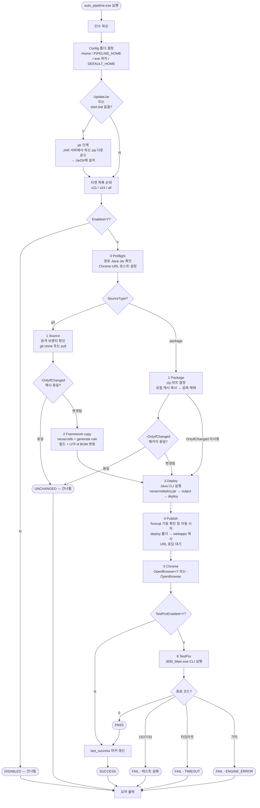

# auto_pipeline.py — Python 포트 가이드

> Nexacro N v21/v24 무인 배포·검증 파이프라인의 Python 구현체.  
> `auto_pipeline_standalone.bat`(PowerShell 내장)과 **동일한 설정 파일**, **동일한 CLI 옵션**, **동일한 단계 순서**를 가진다.

---

## 1. 파일 구성

```
python/
├── auto_pipeline.py        — 소스 (표준 라이브러리만 사용, 외부 의존성 없음)
├── build_exe.bat           — Nuitka로 단일 exe 컴파일 → build\auto_pipeline.exe → ..\auto_pipeline.exe
├── build/
│   └── auto_pipeline.exe   — 컴파일 결과물 (배포 시 사용)
└── README.md               — 이 문서
```

실행 파일은 빌드 후 **부모 폴더(`Tools\AutoPipeline\`)** 에 복사된다.  
파이프라인 설정 파일(`pipeline_v21.txt`, `pipeline_v24.txt`)과 나란히 위치해야 한다.

---

## 2. 전체 작업 순서도



---

## 3. 단계별 상세

### [jar] Deploy JAVA 엔진 갱신

- **실행 조건**: `-UpdateJar` 지정 또는 `JarDir`에 `start.bat`가 없을 때
- `JarDir`이 `work_root` 바깥이면 보안상 거부(`assert_under`)
- JAR 서버(`http://59.10.169.82:9900`)에서 최신 연도 폴더 → 최신 zip 탐색
- 더블 압축 구조를 자동 처리 (zip 안의 zip 추출)
- 이미 최신이면 `[SKIP]`

### [0] Preflight — 사전 점검

| 점검 항목 | 실패 조건 |
|---------|---------|
| `ProjectPath` | 파일 없음 |
| `TomcatHome` | 폴더 없음 |
| `java.exe` | `JavaHome\bin\java.exe` 없음 |
| `start.bat` | `JarDir` 하위에 없음 (`-UpdateJar` 안내) |
| `WebContext` | Tomcat 보호 앱(`root`, `manager` 등) + `PublishSubDir` 없음 |
| `ChromePath` | `OpenBrowser=Y`인데 exe 없음 |

- `ServerHost=auto` 이면 로컬 IPv4 자동 감지 (루프백·APIPA 제외)
- `{Branch}` 치환, `SourceType` 결정

### [1] Source — git 모드

1. 브랜치 버전 검증: `_NN.0.0.N` 패턴이 `ExpectedVersion`과 불일치하면 즉시 실패
2. `git ls-remote`로 원격 해시 취득 → `-OnlyIfChanged`이면 last_success와 비교
3. `SourceDir` 없음 → 디스크 여유 확인 후 `git clone --single-branch`
4. 이미 존재 → origin URL 비교 → lock 파일 확인 → `git pull --ff-only`

### [1] Package — 패키지 모드

1. zip 위치 결정 순서: `PackagePath` > `PackageRoot\{branch}\{build}\{zip}`
2. `PackageBuild=latest` 이면 날짜+시퀀스 기준으로 최신 빌드 폴더 자동 선택
3. 로컬 캐시(`work\package\`) 사용 (크기·수정 시각 일치 시 재복사 생략)
4. `nexacrolib.json` 버전 확인 → `ExpectedVersion` 불일치 시 실패

### [2] Framework copy — 엔진 빌드

- `SourceDir\Lib\FrameworkJS` → `work\{target}\nexacrolib\nexacrolib\`
- JS 파일 UTF-8 BOM 변환 (UTF-8 without BOM → with BOM)
- `Tools\Lib\TiMetainfoLib\res` → generate rule
- v24: `Tools\Lib\TiGenerateLib\Template\24` 추가 복사

### [3] Deploy — Nexacro 배포 CLI

```
java -classpath libs/* com.nexacro.build.cli.Main
     -P <project.xprj>
     -B <nexacrolib>
     -O <output>
     -GENERATERULE|-CSSRULE <generate>
     -D <deploy>
     [Flags from pipeline_*.txt: -MERGE, -COMPRESS, ...]
```

- v21: `-CSSRULE`, v24: `-GENERATERULE`
- 종료 코드 0이 아니거나 deploy 폴더가 비어있으면 실패

### [4] Publish — Tomcat 배포

1. Tomcat 포트 응답 확인 → 없으면 `catalina.bat start` 자동 실행 (최대 60s 대기)
2. 기존 webapps 폴더 삭제 → deploy 폴더 복사
3. `StartPage` 자동 결정: `index.html` → 알파벳 첫 HTML → 없으면 컨텍스트 루트
4. URL 응답 확인 (최대 60s)

### [5] Chrome

- `OpenBrowser=N` 또는 `-NoBrowser` 이면 `[SKIP]`
- `--user-data-dir`, `--no-first-run`, `--new-window` 기본 적용
- `-DevTools` 이면 `--auto-open-devtools-for-tabs` 추가

### [6] TestPro — JEBI_Main.exe CLI

**실행 조건**: `TestProEnabled=Y`

#### [6-0] Preflight

| 점검 항목 | 실패 조건 |
|---------|---------|
| `JebiExePath` | 미설정 또는 파일 없음 |
| `TestMode` | `scenario`, `file`, `parallel` 외 값 |
| `TestScenarioFile` | `scenario` 모드에서 미설정/없음 |
| `TestTCFiles` | `file` 모드에서 1개 이상 필요; 각 파일 존재 확인 |
| `TestParallelManifest` | `parallel` 모드에서 미설정/없음 |

- `TestSourceFile` 미설정 → `work\{target}\dummy.json` (내용: `{}`) 자동 생성
- `TestOutputDir` 미설정 → `work\{target}\test-result` 자동 지정 (기존 폴더 삭제 후 재생성)

#### [6-1] 실행

| 모드 | CLI 형태 |
|------|---------|
| `scenario` | `JEBI_Main.exe -s <dummy> --run-scenario <SCM.json> --output <dir> [옵션...]` |
| `file` | `JEBI_Main.exe -s <dummy> --run-file <TC1> <TC2> ... --output <dir> [옵션...]` |
| `parallel` | `JEBI_Main.exe --run-parallel <manifest.json>` |

공통 선택 옵션:

| 설정 키 | CLI 플래그 |
|--------|----------|
| `TestHeadless=Y` | `--headless` |
| `TestSkipDuplicatePreconditions=Y` | `--skip-duplicate-preconditions` |
| `TestFailOnPageError=Y` | `--fail-on-page-error` |
| `TestVarsFile=<path>` | `--vars <path>` |
| `TestScenarioId=<id>` | `--scenario-id <id>` |

- stdout / stderr를 `_jebi_stdout.log` / `_jebi_stderr.log`에 캡처 → 파이프라인 로그에도 출력
- `TestTimeoutSec` 초과 시 프로세스 강제 종료 → `TIMEOUT`
- 타임아웃 구현: `proc.wait(timeout=sec)` → `subprocess.TimeoutExpired` → `proc.kill()`

#### [6-2] 종료 코드 분류

| 종료 코드 | TestStatus |
|---------|-----------|
| `0` | `PASS` |
| `15`, `27`, `33` | `FAIL` (실행은 됐으나 결과 실패) |
| 그 외 | `ENGINE_ERROR` (설정/실행 오류) |
| 타임아웃 | `TIMEOUT` |

#### [6-3] 결과 집계

- `TestOutputDir` 내 `*.json` 파일 순회 (`_`로 시작하는 로그 파일 제외)
- 각 JSON에서 `pass`/`passed`, `fail`/`failed` 필드 합산
- `TestStatus != PASS` 이면 파이프라인 FAIL

---

## 4. 주요 내부 함수

| 함수 | 역할 |
|------|------|
| `read_config(path)` | `pipeline_*.txt` 파싱, PATH_KEYS 상대→절대 변환, 필수 키 검증 |
| `is_yes(value)` | `Y/YES/TRUE/1` 여부 확인 |
| `lp(path)` | Windows 260자 제한 우회 (`\\?\` 접두어) |
| `assert_under(path, root)` | 허용 루트 밖 조작 거부 |
| `remove_tree(path)` | 읽기 전용 파일 포함 강제 삭제 |
| `run(cmd)` | 외부 프로세스 실행, stdout 실시간 출력 |
| `capture(cmd)` | 외부 프로세스 실행, 출력을 리스트로 반환 (에코 없음) |
| `step(ctx, name, body, when)` | 단계 실행 래퍼 — 타이밍 측정, Steps 기록, `when=False`이면 건너뜀 |
| `invoke_target(ctx, opt, root)` | 단일 타겟(v21/v24)의 전체 파이프라인 실행 |
| `get_local_ipv4()` | 루프백·APIPA 제외한 실제 로컬 IP 반환 |
| `wait_url(url, timeout)` | HTTP 200 응답을 n초 안에 대기 |
| `decode(raw)` | UTF-8 → CP949 순으로 바이트 디코딩 |
| `get_latest_build(folder)` | `YYYY.M.D.N` 형식 빌드 폴더 중 최신 선택 |

---

## 5. 설정 파일 (`pipeline_*.txt`) 주요 키

> 전체 항목은 `Tools\AutoPipeline\README.md` 5장 참조.

```ini
Enabled=Y               # N이면 이 타겟 전체 건너뜀
ExpectedVersion=21      # 21 또는 24 (버전 불일치 시 즉시 실패)
SourceType=git          # git | package
Branch=master_21
SourceDir=D:\git\{Branch}
ProjectPath=D:\nexacro UI\...\project.xprj
WorkDir=D:\git\...\work\v21
JarDir=D:\git\...\work\jar
TomcatHome=C:\apache-tomcat-11.0.25
TomcatPort=8080
WebContext=auto_v21
OpenBrowser=N
ChromePath=C:\Program Files\Google\Chrome\Application\chrome.exe

# [6] TestPro
TestProEnabled=N
JebiExePath=
TestMode=scenario       # scenario | file | parallel
TestScenarioFile=
TestOutputDir=          # 비우면 work\v21\test-result 자동
TestHeadless=Y
TestTimeoutSec=600
```

### PATH_KEYS — 상대 경로 자동 변환 대상

`read_config()` 내에서 설정 파일 위치 기준으로 절대 경로로 변환된다.

```
SourceDir, ProjectPath, WorkDir, JarDir, TomcatHome, JavaHome,
ChromePath, PackageRoot, PackagePath,
JebiExePath, TestScenarioFile, TestParallelManifest,
TestOutputDir, TestVarsFile, TestSourceFile
```

`TestTCFiles`는 `|` 구분 목록이므로 제외 — `[6]` 단계 내부에서 개별 변환.

---

## 6. CLI 사용법

```cmd
auto_pipeline.exe [v21|v24|all] [옵션...]
```

| 옵션 | 설명 |
|------|------|
| `v21` / `v24` / `all` | 실행 타겟 (기본 `all`) |
| `-Branch <name>` | 이번 실행만 브랜치 오버라이드 (`v21` 또는 `v24`에서만) |
| `-SourceType git\|package` | 이번 실행만 소스 타입 오버라이드 |
| `-Build <folder>` | 이번 실행만 패키지 빌드 폴더 지정 |
| `-UpdateJar` | JAR 엔진 강제 재설치 |
| `-SkipGit` | git 작업 생략 (SourceDir가 이미 존재해야 함) |
| `-OnlyIfChanged` | 마지막 성공 이후 변경이 없으면 건너뜀 |
| `-OpenBrowser` | Chrome 강제 열기 |
| `-NoBrowser` | Chrome 열기 억제 |
| `-DevTools` | Chrome DevTools 자동 열기 |
| `-Home <path>` | 설정 폴더 지정 |
| `-Help` | 도움말 출력 |

**Config 폴더 결정 순서**: `-Home` > 환경 변수 `PIPELINE_HOME` > exe 위치 > `DEFAULT_HOME`

---

## 7. 요약 출력 예시

```
==============================================
 AutoPipeline summary
==============================================
 [v21] SUCCESS
   Branch  : master_21 (git)
   Version : 21.0.0.2100
   Commit  : 3b64f73 Fix grid scroll issue
   URL     : http://172.10.12.46:8080/auto_v21/index.html
   Steps   : 0 Preflight 1.2s | 1 Source 8.4s | 2 Framework copy 14.3s | 3 Deploy 47.7s | 4 Publish 2.2s | 5 Chrome 0.1s | 6 TestPro 18.4s
   TestPro : PASS Pass 52, Fail 0 18.4s
 [v24] FAIL
   Branch  : master (git)
   Version : 24.0.0.9999
   Commit  : 1a69f17 Add new component
   URL     : http://172.10.12.46:8080/auto_v24/index.html
   Steps   : 0 Preflight 1.1s | 1 Source 9.2s | 2 Framework copy 18.6s | 3 Deploy 84.6s | 4 Publish 5.6s | 5 Chrome 0.1s | 6 TestPro 32.1s
   TestPro : FAIL Pass 48, Fail 4 (exit 27) 32.1s
   Error   : TestPro FAIL (exit 27) Pass 48, Fail 4
 Log: D:\...\logs\20261008_093012_all.log
==============================================
```

---

## 8. exe 빌드 (`build_exe.bat`)

Nuitka로 `.py` → 단일 네이티브 exe 컴파일. 외부 패키지 없음 (표준 라이브러리만 사용).

```cmd
cd Tools\AutoPipeline\python
build_exe.bat
```

**사전 요건**: Python 3.12 + Nuitka

```cmd
python -m pip install nuitka ordered-set zstandard
```

**첫 빌드**: MinGW64 자동 다운로드 (~300MB, 최초 1회)

| 컴파일 옵션 | 효과 |
|-----------|------|
| `--onefile` | 단일 exe (배포 용이) |
| `--mingw64` | MinGW64 컴파일러 사용 |
| `--python-flag=no_docstrings,no_asserts` | docstring·assert 제거 (크기/속도) |
| `--windows-console-mode=force` | 콘솔 창 강제 표시 |
| `--remove-output` | 중간 C 파일 자동 삭제 |

빌드 완료 후 `build\auto_pipeline.exe` → 자동으로 `..\auto_pipeline.exe` 복사.

---

## 9. standalone.bat vs Python exe 주요 차이

| 항목 | standalone.bat (PowerShell) | auto_pipeline.py (Python) |
|------|----------------------------|--------------------------|
| 런타임 | PowerShell 5.1 내장 | Python 3.12 → Nuitka exe |
| 배포 | bat 파일 하나로 자급 | exe 빌드 필요 (build_exe.bat) |
| 타임아웃 | `proc.WaitForExit(ms)` | `proc.wait(timeout=sec)` |
| 텍스트 인코딩 | ASCII 제약 (PS 5.1 bat 내 한글 불가) | UTF-8 완전 지원 |
| 로그 | `Start-Transcript` 방식 | 파일 직접 기록 (`_log_fp`) |
| 경로 260자 제한 | `\\?\` 처리 일부 | `lp()` 함수로 전체 적용 |
| 설정 파일 | 동일 (`pipeline_*.txt`) | 동일 |
| 단계 로직 | 동일 | 동일 |

---

## 10. 변경 이력

| 날짜 | 내용 |
|------|------|
| 2026-10-01 | 초기 버전 — `[jar]` ~ `[5] Chrome` 구현 |
| 2026-10-08 | `[6] TestPro` 단계 추가, `PATH_KEYS` 확장, `import json` 추가 |
